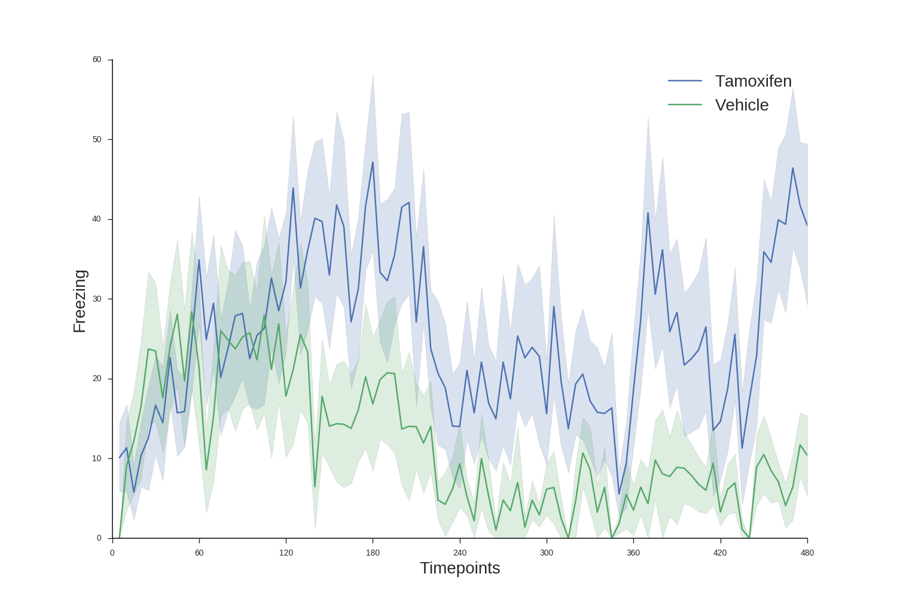
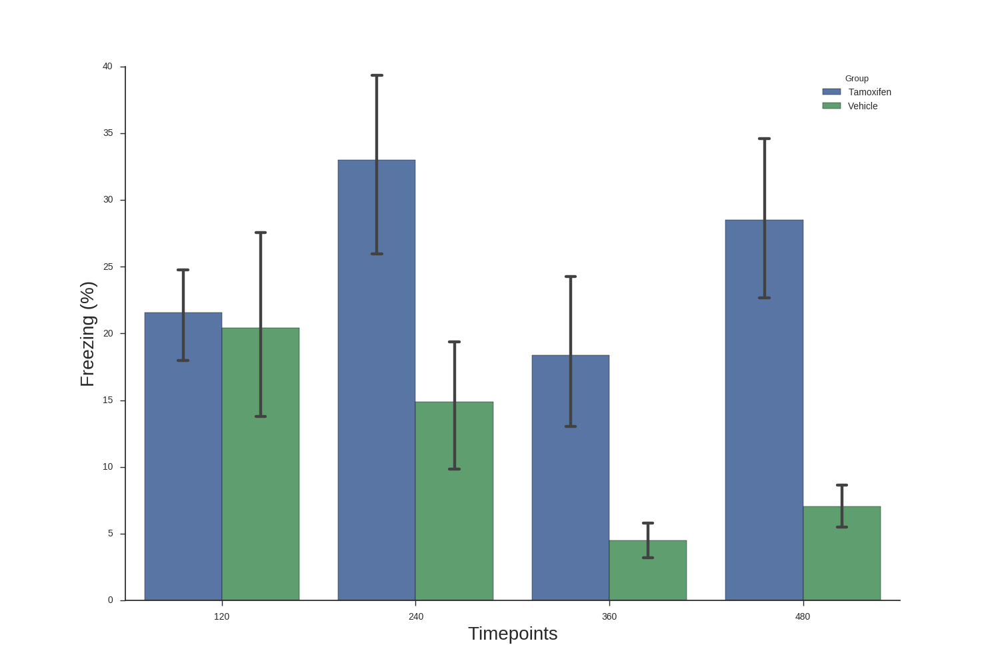

# Optogenetics Freezing Analysis

This is a set of scripts to analyze and visualize freezing data generated from cyansite.cc/freeze.html where the output on the side panel is copied and pasted into a .txt file as is. You can visualize as a time series for more short time bins, or as a bar plot for larger time bins (or vice versa if you so choose, but I do wonder why you would...)

## File Preparation
1. Use cyansite.cc/freeze.html to score your freezing and copy and paste the freezing results into a text editor. Save as **"animalname_group"** with group being whichever way you have blinded yourself. 
  - You must check the very last entry of each file and remove it if it is an incomplete freezing episode (e.g.     
  `476 - `    
  where you pressed 'f' to initiate an episode and the video ended before you could close off the episode)
2. Put all the .txt files from the same experiment in the same folder and keep note of their location. 
3. Create a groups.txt file (named exactly as such) in the same folder with the following:
  - **First Line**: the groups you used in your file naming convention for this experiment separated by commas
  - **Second Line**: a python dictionary indicating your corresponding unblinded group names in the same order as you entered the blinded group names in the first line, starting from 0 to the number of groups you have.
   - See below for example where group 1 corresponds to your vehicle group and group 2 corresponds to the drug group.
   ~~~~
   group1, group2
   {0: 'Vehicle', 1: 'Drug'}
   ~~~~
  - Make sure there is not any extra lines of whitespace in this groups.txt file. 
  
## Usage
Using shell, you can run the following:  

  `python main.py /directory/ bin_size total_time output.csv --style`  
  
Where:  
- /directory/ is the location of your animalname_group.txt and groups.txt files are located
- bin_size is the length of the time bins in seconds
- total_time is the total length of your recording session in seconds
- output.csv is the csv you'd like to save the parsed data in. The format will be one row per animal, where each column after the first column (their group name) gives the freezing percentages for that column's bin.
- optional --style flag: --ts for time series is the default, --bar for a bar plot
